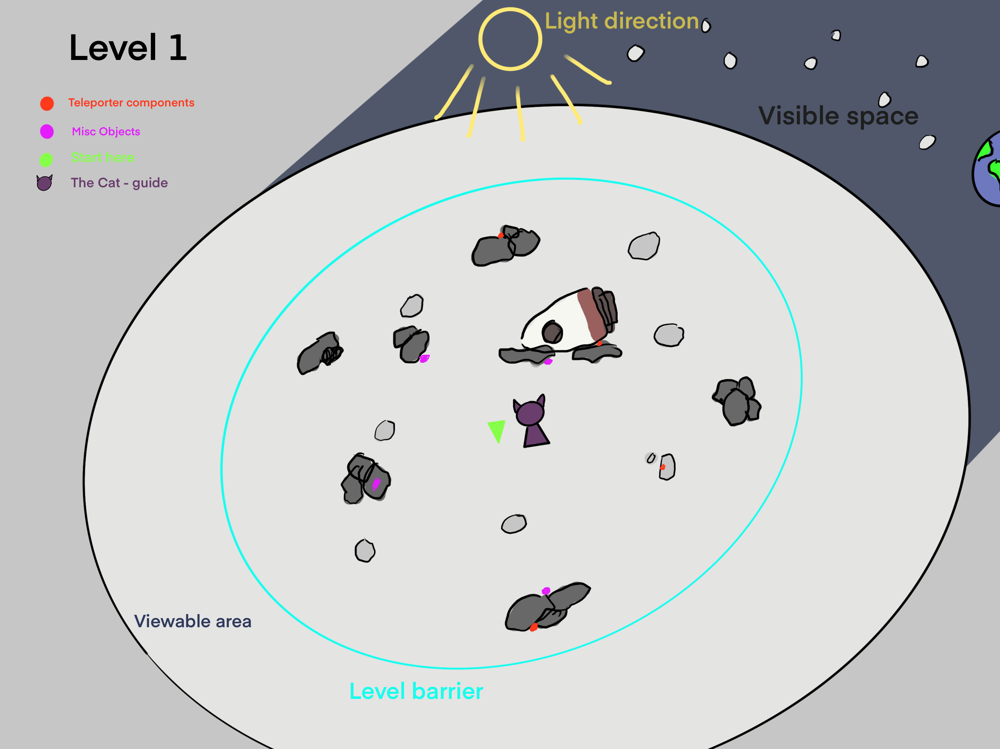
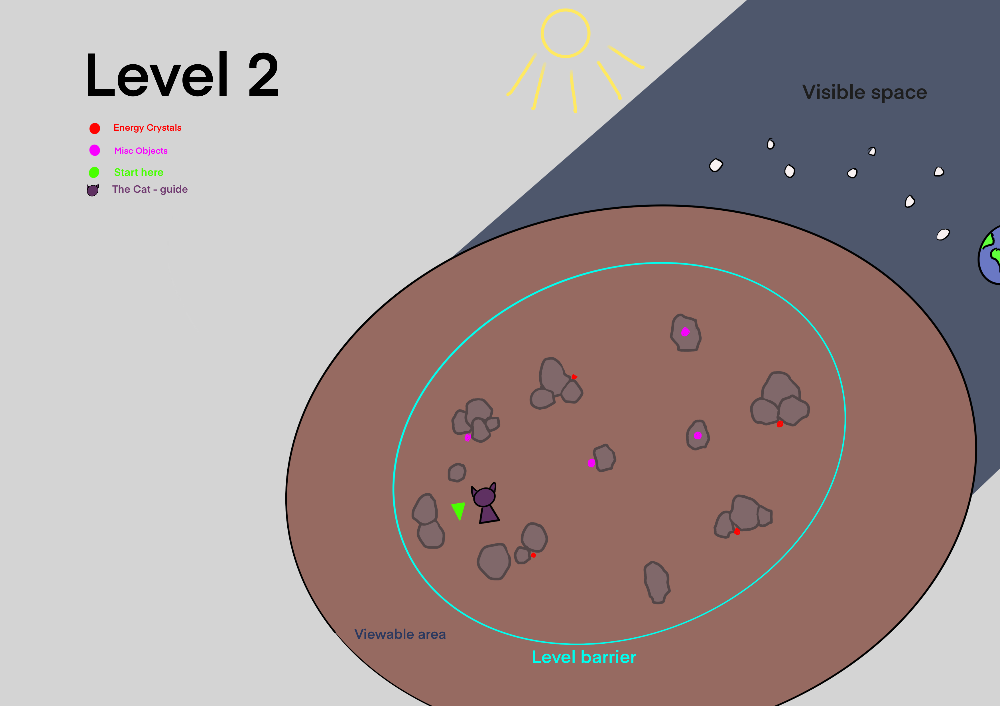
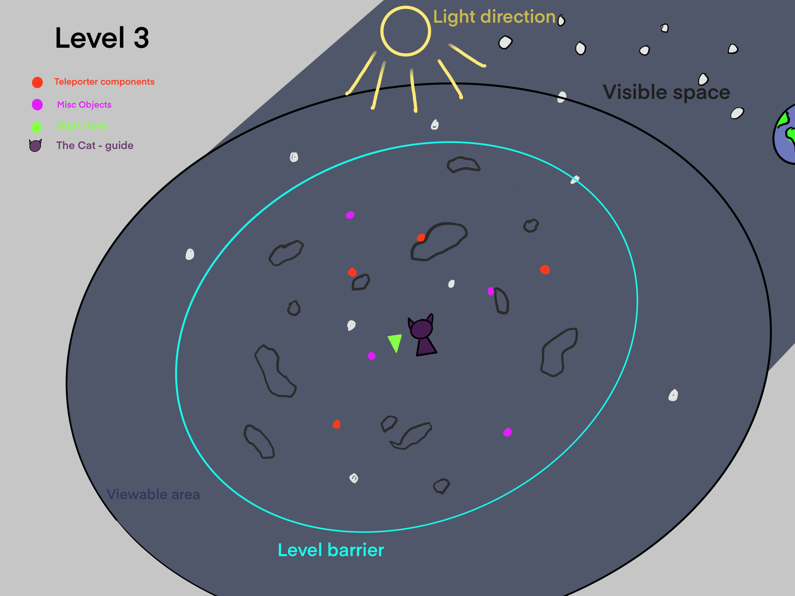

# Game Overview :video_game:

## Prolouge:
Dark screen, a dialouge box appears showing text: "Hello wanderer, What is your name?" (Here you can enter a name).
Then the text changes to "I see [name], you are a long way from home" and then "Let us help you get back".
Game starts on first level.

## Level Overview:
Level 1:
- Set on the surface of the moon
- There is rubble scattered around you
- **The Cat** implores you to find all the parts to build a teleporter before your oxygen runs out.
- If you need clues - exchange for oxygen.
- Successfully build the teleporter or suffocate

Level 2:
- Set on an astroid.
- You need to recharge your teleporter
- **The Cat** implores you to find all the crystals to recharge the teleporter before your oxygen runs out.
- If you need clues - exchange for oxygen.
- Successfully recharge the teleporter or suffocate.

Level 3:
- Set in Space
- The journey was rocky so the telporter is broken.
- **The Cat** implores you to fix the teleporter before your oxygen runs out.
- This level you start with less oxygen due to the accident.
- If you need clues - exchange for oxygen.
- Successfully fix the teleporter or suffocate.

## Epilouge
After the final teleportation, the screen goes black and a text box appears saying: "That will be all my friend". Then a picture of a field on earth with a text box displaying "Welcome Home". 

## End Conditions
Out of Oxygen:
- There are 100 units of oxygen each level which decrease every 4 seconds (might need to balance this)
- Maybe last level there is less oxygen

Finish all three levels:
- Complete all three levels and get to Earth.

