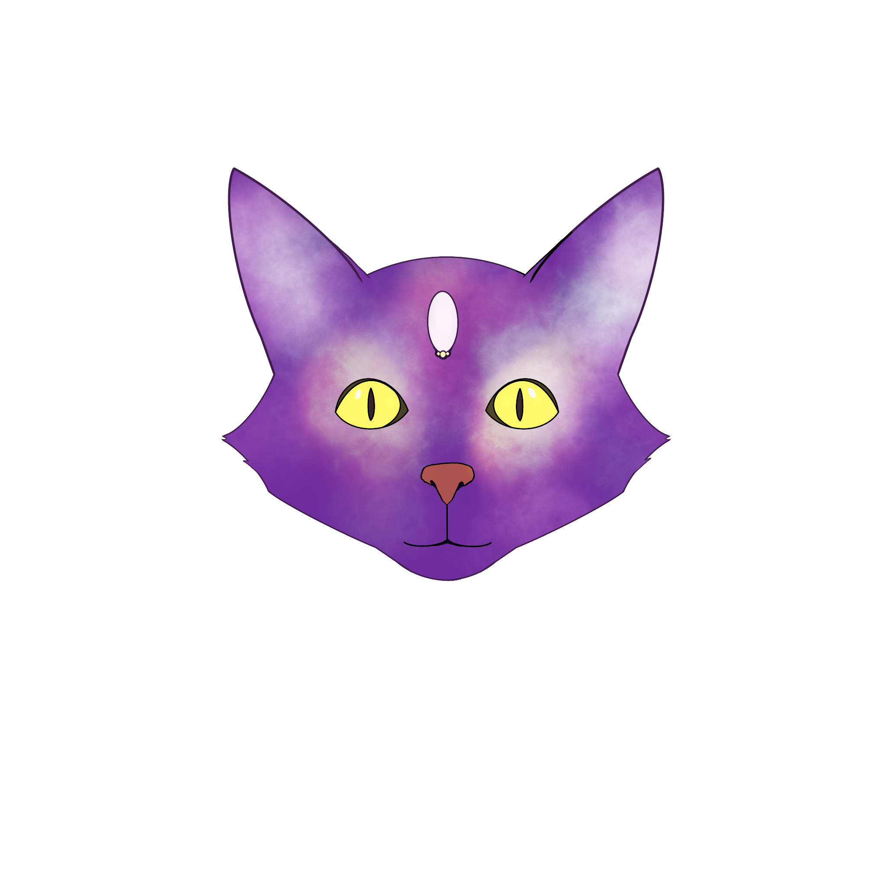

# Game Overview :video_game:
## Main menu:
You may choose to start with any level though the journey is best started from level 1.

## Prologue:
Dark screen, a dialouge box appears showing text: "Hello wanderer, What is your name?" (Here you can enter a name).
Then the text changes to "I see, [name], you are a long way from home" and then it explains the objective and the level keys.
The user can click "Start Game" and the Game starts on first level.

## Level Overview:
Level 1:
- Set on the surface of the moon
- There is rubble scattered around you
- **The Cat** implores you to find all the parts to build a teleporter before your oxygen runs out.
- If you need clues - exchange for oxygen.
- Successfully build the teleporter or suffocate.
- (The drawing for level 1 was from the planning phase and does not reflect the object placement)

Level 2:
There is a black screen. A dialouge box appears showing text: "Oh wanderer, how could you input the wrong coordinates?". The text changes to "We are on mars now.... so you will need more fuel". The text changes again to "Find the energy crystals around the map". The screen changes to the objective and controls and you can begin the game.
- Set on an mars.
- You need to recharge your teleporter as you are on mars due to you putting the wrong coordinates into the teleporter.
- You start with less oxygen.
- **The Cat** implores you to find all the crystals to recharge the teleporter before your oxygen runs out.
- If you need clues - exchange for oxygen.
- Successfully recharge the teleporter or suffocate.
- (The drawing for level 2 was from the planning phase and does not reflect the object placement)

Level 3:
There is a black screen. A dialouge box appears showing text: "The teleporter is broken! Don't worry. There is still a way." Then the text changes to "Find all the numbers to the code." The text changes again to "Input them on the magic carpet". Finally the objective is shown with the controls once more.
- Set on astroid
- The journey was rocky so the telporter is broken.
- **The Cat** implores you to find the code so that you can get to earth through other means (magic carpet).
- This level you start with less oxygen due to the accident.
- The player is required to look around to find the digits to the code, then input them by clicking the magic carpet.
- If you need clues - exchange for oxygen.
- Successfully escape or suffocate.
- (The drawing for level 3 was from the planning phase and does not reflect the object placement)
  

## Epilogue
After the final teleportation, the screen displays a picture of a field on earth with a text box displaying text about how you are home now. 

## End Conditions
Out of Oxygen:
- There is 100 units of oxygen on the first level which decrease every few seconds.
- There is 90 units of oxygen on the second level which deacreses every few seconds.
- There is 80 units of oxygen on the third level which deacreses every few seconds.

Level 1:
- Collect all five teleporter components: Battery, Console, Antenna, Activation button and Circuit.
  
Level 2:
- Collect all five energy crystals: Lava Obsidian, Power Crystal, Jubilee Gem, Red Ruby, Diamant.

Level 3: 
- Collect all five numbers to the code: 0, 1, 2, 4, 9. Click the carpet and input them in the correct order to win.

Finish all three levels:
- Complete all three levels and get to Earth. (The true ending)

