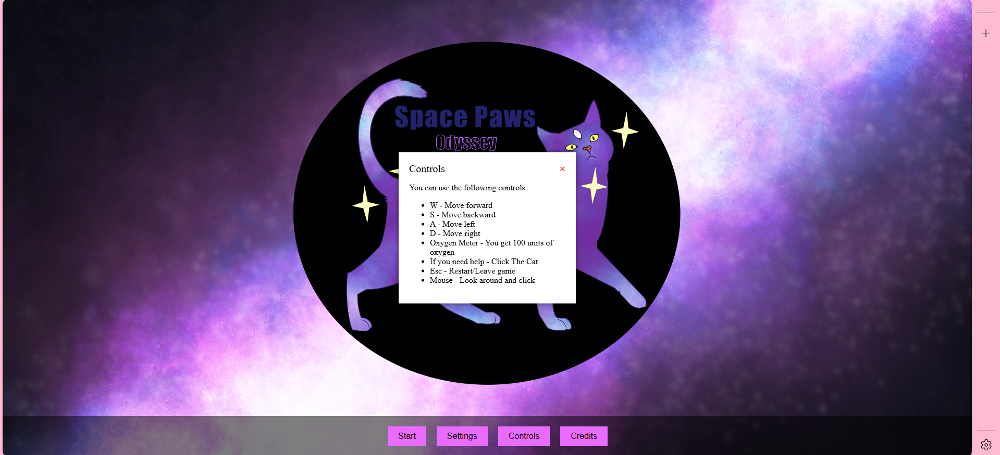

# Gameplay Mechanics :joystick:

## Controls
Players can viewthe control scheme by navigating to *Main Menu*. The control setup remains consistent across all levels, ensuring familiarity as gameplay complexity increases with more obstacles and faster enemies.

In-game actions such as picking up items or using abilities will trigger responsive on-screen feedback, including text prompts and sound cues, enhancing immersion and responsiveness.

### Movement
- **W**: Move Forward
- **S**: Move Backward
- **A**: Move Left
- **D**: Move Right
- **Shift + Direction**: Sprint (Increases avatar speed, consuming more oxygen or stamina)

### Camera Controls
- **Changing Views**: Press **F** to change view from first person view to third person view when in third person view, and vice versa.
- **Mouse Movement**: Adjust camera view to look around and explore the environment. When in third person view, press escape (esc) to show cursor and interact with environment. Then press F twice to be able to adjust camera in first person again. When in third person view, right click and drag to adjust 

### Environment Interaction
- Left click item to get a pop up that explains what the item is. Click "Add to inventory!" to add the item to your inventory.

### Inventory and Item Management
- Click the backpack modal to open the inventory, or to close it.

## Viewing

- The game is viewed in both first person and third person view. Press F to change views.