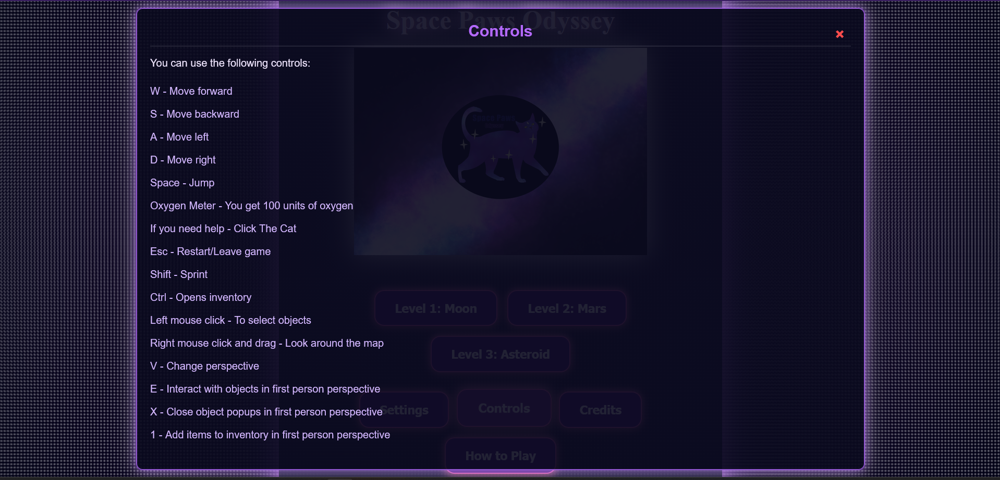

# Gameplay Mechanics :joystick:

## Controls
Players can view the control scheme by navigating to *Main Menu*. The control setup remains consistent across all levels, ensuring familiarity as gameplay complexity increases with more obstacles and faster enemies.

In-game actions such as picking up items or using abilities will trigger responsive on-screen feedback, including text prompts and sound cues, enhancing immersion and responsiveness.

### Movement
- **W**: Move Forward
- **S**: Move Backward
- **A**: Move Left
- **D**: Move Right

### Camera Controls
- **Changing Views**: Press **V** to change view from third person view to first person view. When in first person view press **V** to change back to third person view.
- **Mouse Movement**: Adjust camera view with right mouse click to look around and explore the environment. When in third person view use left mouse click to interact with objects. 

### Environment Interaction
- Left click an item to get a pop up that explains what the item is. Click "Add to inventory!" to add the item to your inventory.

### Inventory and Item Management
- Click the backpack modal to open the inventory, or to close it.
- The inventory can also be opened and closed by clicking **CTRL**

## Viewing
- The game is viewed in both first person and third person view. Press **V** to change views.
- **Mouse Right Click and Drag**: Adjust camera view to look around and explore the environment.
- There is an option to view the game in **PiP** this is toggled using the `PiP` button in the top left corner.

### Environment Interaction
- **Left Mouse Click**: Pick up items. Items will display a description when clicked, making it clear what can be collected or interacted with.

## Viewing

The game is viewed through a third person point of view. Therefore, our playable character (the astronaut) is visible at all times. Making use of third person point of view allows the player to move the camera 360 degrees, without having to move the playable character, which will aid the player in finding the needed objects.

The player will be able to control the direction of the viewport by right clickinh and moving the mouse. The player could also use the touchpad on their computer, however using a mouse is advised.

When **V** is clicked the view will become first person prespective.
When the **PiP** button is pressed the player will see a **PiP** version of their screen.
