# Graphics and Visuals  :art:

## 3-Dimensional Graphics

### Models
We plan to get most of our low poly models from https://poly.pizza/
- Astronaut model: https://poly.pizza/m/0oBRDJ9Zl9, https://poly.pizza/m/dLHpzNdygsg
- **The Cat** model: Through blender we created **The Cat** model.

#### **The Cat** creation process

To aid in the modelling process a tutorial was followed: https://blenderartists.org/t/easy-sculpting-tutorial-cat-new/1445277
The model was created in blender.

Step 1: Create the basic cat shape
- Use basic shapes (ovel for body, circuler shape for the hips, ovels for the paws and legs, spehere for the head and circular shapes for the ears).

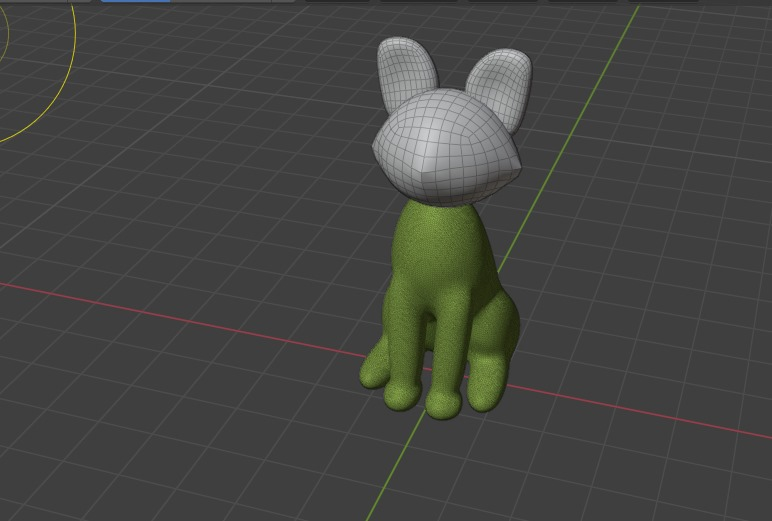
  
Step 2: Refine the features through sculpting
- Useing blenders array of sculpting tools (specifically the 'grab' and 'draw sharp' sculpting tools), the models body was refined to more closely resemble a cat.

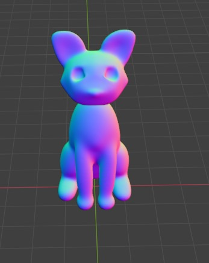
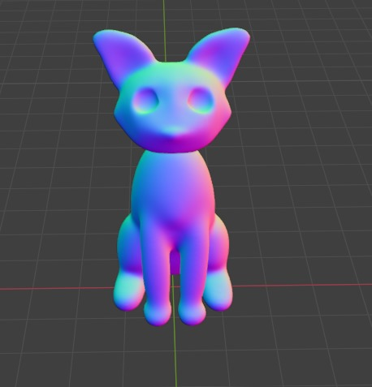
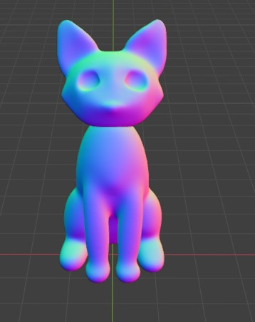

- Using smaller spheres - eyes were created.

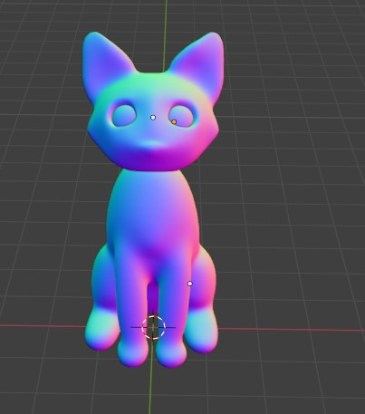

- The final sculpture looked like:
  
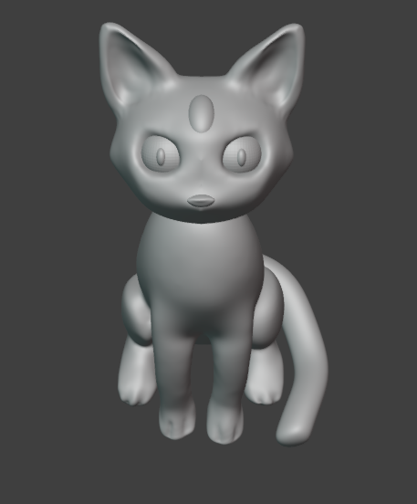
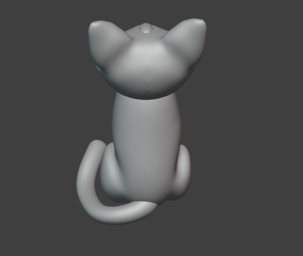

Step 3: Add the texture
Initially I tried to use an image texture. Getting an image to fit the model was quite difficult as there would be repeats in the texture. 
So instead I created a custom paintend texture by unwrapping the model and letting blender create a texture map.
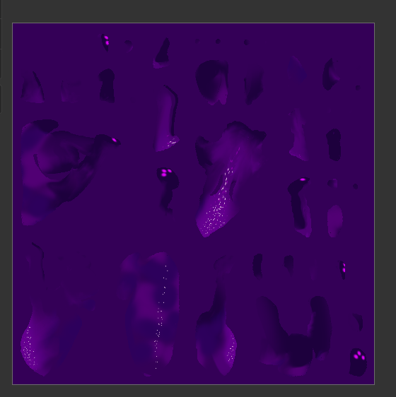

The final outcome looked like:

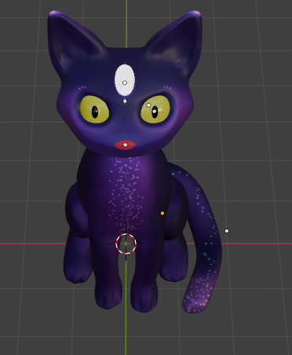
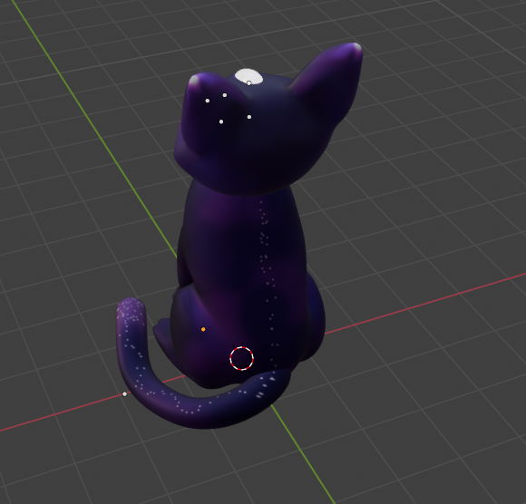

  
### Textures
- The astroid and moon floor will have textures to resemble a rough ground.
- The cat model employs a custom painted texture:
  

## 2-Dimensional Raster Graphics
There are many 2D raster graphics drawings to accompany the game and make it feel more polished.

2D Game Logo:
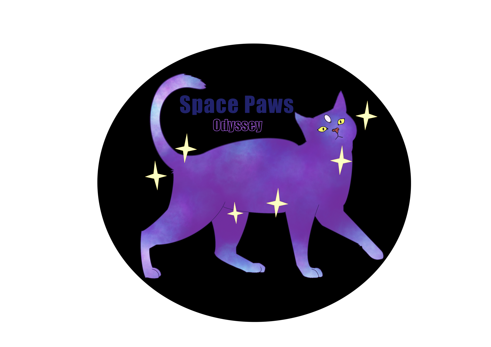

2D **The Cat** sprite for dialouge:

Drawn by Claire Newman (2549861)

