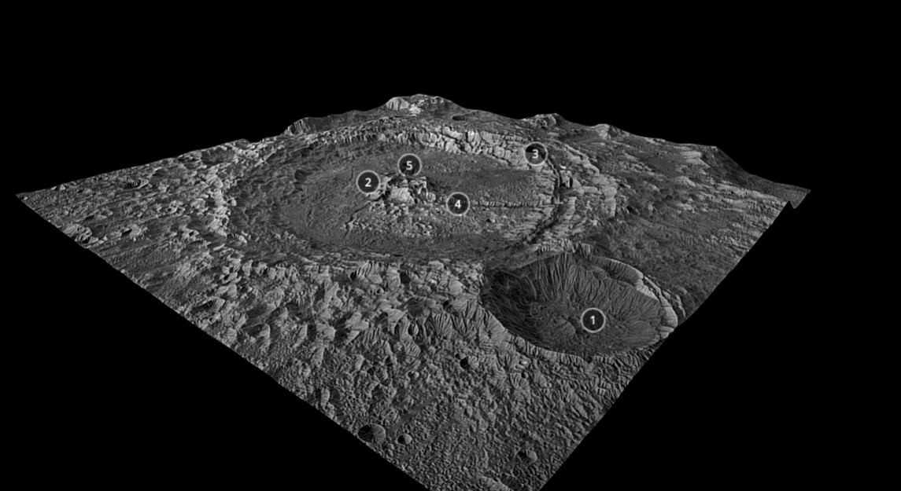

# Graphics and Visuals  :art:

## 3-Dimensional Graphics

### Models
We plan to get most of our low poly models from https://poly.pizza/
- Astronaut model: https://poly.pizza/m/0oBRDJ9Zl9, https://poly.pizza/m/dLHpzNdygsg
- **The Cat** model: Through blender we created **The Cat** model.
- The planets and the sun: Made using Three.js sphere primitives. 
- The barrel model by by `TextureCan.com` under the Creative Commons CC0 1.0 Universe License Available at: https://www.texturecan.com/models/details/528/#google_vignette
- The skull model by `martinjario` on Sketchlab CC BY 4.0. Available at: https://skfb.ly/JrST
- Rock by Danni Bittman [CC-BY] via Poly Pizza
- Rocks by Quaternius
- Rock by Quaternius renamed as RockQ
- basic stone 3 by felix stief [CC-BY] via Poly Pizza renamed as basic_stone_3
- Rocketship by jeremy [CC-BY] via Poly Pizza
- Rubble Rocks by Kyle Hickman [CC-BY] via Poly Pizza renamed as Rubble_Rocks
- Ruin by nha pham [CC-BY] via Poly Pizza
- Space rock by 11.10melons on Sketchfab
- Comet by Poly by Google [CC-BY] via Poly Pizza
- Space Rock by bmead92 on Sketchfab  - pink crystal renamed as space_crystal
- Flying saucer by Poly by Google [CC-BY] via Poly Pizza renamed as Flying_saucer

- Debris Papers by Quaternius
- Small Stack of Paper by Jarlan Perez [CC-BY] via Poly Pizza
- Paper by Poly by Google [CC-BY] via Poly Pizza
- Manila Envelope by Jarlan Perez [CC-BY] via Poly Pizza
- Paper airplane by Poly by Google [CC-BY] via Poly Pizza

- Blue Quartz by `cgtrader.com`, copyright free can be found at: https://www.cgtrader.com/free-3d-models/various/various-models/dimond-game-asset
- Lava Obsidian by `rigmodels.com`,copyright free can be found at: https://rigmodels.com/model.php?view=Crystal._Scan.-3d-model__a4a559d70c3e447fa878518e7aca79a8#google_vignette
- Chest of of gold by `cgtrader.com`, copyright free can be found at: https://www.cgtrader.com/free-3d-models/furniture/cabinet/low-poly-game-object-modeling
- Red Ruby Gem by `cgtrader.com`, copyright free can be found at: https://www.cgtrader.com/items/3705550/download-page

#### **The Cat** creation process

To aid in the modelling process a tutorial was followed: https://blenderartists.org/t/easy-sculpting-tutorial-cat-new/1445277
The model was created in blender.

Step 1: Create the basic cat shape
- Use basic shapes (ovel for body, circuler shape for the hips, ovels for the paws and legs, spehere for the head and circular shapes for the ears).

  
Step 2: Refine the features through sculpting
- Useing blenders array of sculpting tools (specifically the 'grab' and 'draw sharp' sculpting tools), the models body was refined to more closely resemble a cat.

- Using smaller spheres - eyes were created.

- The final sculpture looked like:
  

Step 3: Add the texture
Initially I tried to use an image texture. Getting an image to fit the model was quite difficult as there would be repeats in the texture. 
So instead I created a custom paintend texture by unwrapping the model and letting blender create a texture map.

The final outcome looked like:

#### Level 1 - Decorating the level
Using custom positions the map was decorated with various rocks. The scale and the rotation of most of the rocks will be random each refresh.
- A spaceship model was rotated and positioned to look as if it had crashed on the surface.
- A comet model was rotated and positioned to look as if it had crystalised on the moons surface.
- A 'ruins' model was positioned on the surface.

  
### Textures
- The asteroid and moon floor will have textures to resemble a rough ground.
- The textures for the stars and planets are from: https://www.solarsystemscope.com/textures/ 
- The cat model employs a custom painted texture:

## Level 1 Environment

Level 1 is set on the moon's surface with the background being Earth, Neptune Jupiter, the Sun, and some stars.

### Moon Surface Model
To create the realistic lunar landscape for Level 1, we integrated a detailed moon surface model sourced from [Sketchfab](https://sketchfab.com/3d-models/moon-petavius-crater-ce9c009b517b421eab8c8429b536382f), uploaded by [SebastianSosnowski](https://sketchfab.com/SebastianSosnowski). This model was carefully selected for both visual fidelity and performance optimization, helping establish the atmosphere of the game without sacrificing efficiency.

## 2-Dimensional Raster Graphics
There are many 2D raster graphics drawings to accompany the game and make it feel more polished.
2D Game Logo:

2D **The Cat** sprite for dialouge:

Drawn by Claire Newman (2549861)

